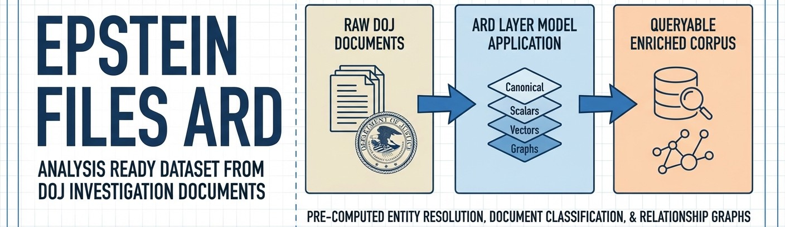

<!--
---
title: "Epstein Files ARD"
description: "Analysis Ready Dataset applying the ARD layer model to DOJ-released Epstein investigation documents"
author: "VintageDon"
orcid: "0009-0008-7695-4093"
date: "2026-02-01"
version: "0.3"
status: "Active"
tags:
  - type: project-root
  - domain: [ard, investigative-journalism, osint]
  - tech: [python, postgresql, pgvector, spacy, rag]
related_documents:
  - "[ARD Methodology](https://github.com/vintagedon/analysis-ready-dataset)"
  - "[DOJ Epstein Library](https://www.justice.gov/epstein)"
---
-->

# 🗂️ Epstein Files ARD

[](https://python.org)
[](https://github.com/pgvector/pgvector)
[](LICENSE)
[](LICENSE-DATA)



> An Analysis Ready Dataset transforming DOJ Epstein investigation files into a queryable, enriched corpus with pre-computed entity resolution, document classification, and relationship graphs.

This project applies the [ARD layer model](https://github.com/vintagedon/analysis-ready-dataset) to publicly released documents from the Jeffrey Epstein investigation. Rather than distributing raw scans and expecting each researcher to independently extract entities, resolve names, and build relationship maps, this ARD front-loads that computational work—performing expensive operations once with rigor so others don't have to repeat them.

---

## ⚠️ Responsible Use

This project processes sensitive documents related to serious crimes. We are committed to ethical data handling:

Victim Protection: We anonymize victim-identifying information in all processed outputs. While unredacted source materials exist publicly, we choose not to perpetuate the exposure of individuals who did not consent to public identification. Researchers using this dataset should maintain the same standard.

What This Means in Practice:

- Victim names, when identifiable, are replaced with anonymized identifiers
- We do not provide tools or guidance for de-anonymizing protected individuals
- Entity resolution focuses on subjects of investigation, not victims
- We acknowledge that determined actors could cross-reference with public sources—we cannot prevent this, but we will not facilitate it

This is a conscious choice to prioritize victim dignity over dataset completeness.

---

## 🔭 Overview

This section explains the ARD approach and project motivation. If you're ready to use the data, skip to [Quick Start](#-quick-start).

The January 2026 DOJ release included over 3 million pages of documents, 180,000 images, and 2,000 videos. These materials are scattered across formats, riddled with OCR noise, and lack structure. Every journalist or researcher working this corpus independently repeats the same foundational processing: extracting entities, resolving name variants, classifying document types, and building relationship networks.

This project absorbs that compute debt. By building an Analysis Ready Dataset, we convert processor time into storage space—pre-computing the derived quantities that appear repeatedly in investigative work but require significant effort to generate.

This is also a learning project. The ARD is being built alongside the [IBM RAG and Agentic AI Professional Certificate](https://www.coursera.org/professional-certificates/ibm-rag-and-agentic-ai), applying each technique to real documents rather than toy datasets.

---

## 🎯 Target Audience

| Audience | Use Case |
|----------|----------|
| Investigative Journalists | Query pre-computed relationships without building NER pipelines |
| OSINT Researchers | Similarity search, entity graphs, cross-document analysis |
| Data Scientists | RAG system development against a real-world messy corpus |
| ARD Implementers | Third case study validating the methodology across domains |

---

## 📊 Project Status

| Area | Status | Description |
|------|--------|-------------|
| Repository Setup | ✅ Complete | M01: Scaffolding, memory bank, scope definition |
| GitHub Project | ✅ Complete | M02: Milestones, labels, 18 tasks configured |
| Source Evaluation | ✅ Complete | M03: Source selection, L0 import with provenance |
| Layer 0: Canonical | 🔄 In Progress | M04: Schema validation, quality audit |
| Layer 1: Scalars | ⬜ Planned | M05: Entity extraction, classification |
| Layer 2: Vectors | ⬜ Planned | M06: Embeddings, similarity search |
| Layer 3: Graphs | ⬜ Planned | M07: Entity resolution, relationships |
| Web Interface | ⬜ Planned | M08: Public search at epsteinfiles.dev |

---

## 📂 Data Sources

This project uses two primary sources for the bounded starter corpus:

| Source | Dataset | Records | Provenance |
|--------|---------|---------|------------|
| [Internet Archive](https://archive.org/details/epstein-flight-logs-unredacted_202304) | Flight Logs | 5,001 | Bradley Edwards court exhibits (Epstein v. Edwards) |
| [epsteinsblackbook.com](https://epsteinsblackbook.com/files) | Black Book | 2,324 | Wayback Machine archived scans |

Full provenance documentation including SHA-256 hashes is available in [research/source-analysis/](research/source-analysis/).

### Why These Sources?

During M03, we evaluated multiple existing datasets:

| Source | Assessment | Decision |
|--------|------------|----------|
| Internet Archive flight logs PDF | Pre-structured 22-column format, 82% passenger identification | ✅ Selected |
| epsteinsblackbook.com black book CSV | Row-level Wayback provenance, parsed fields | ✅ Selected |
| epsteinsblackbook.com flight CSV | OCR artifacts, only 3 columns | ❌ Rejected |
| theelderemo/FULL_EPSTEIN_INDEX | Quality work, but 32K documents exceeds bounded scope | ⏸️ Deferred |

The ARD methodology assumes you inherit from whatever layer exists. We selected the highest-quality existing extractions and will add value through Layers 1-3.

---

## 🏗️ Architecture

### The ARD Layer Model

Each layer builds on the one below, enabling progressively richer query patterns:


### Initial Scope: Bounded Starter Corpus

| Document Set | Records | Structure | Value |
|--------------|---------|-----------|-------|
| Flight Logs | 5,001 | Tabular (date, route, passengers) | Temporal patterns, co-occurrence |
| Black Book | 2,324 | Contact directory (names, phones, addresses) | Entity baseline, relationship seeds |

These two datasets are highly structured, naturally joinable, and provide concrete deliverables while the methodology matures.

### Technology Stack

| Component | Technology | Purpose |
|-----------|------------|---------|
| Processing | Python 3.11+, pandas, spaCy | Ingestion, NER, transformation |
| Storage | PostgreSQL 16+ | Primary data store |
| Vector Search | pgvector | Similarity queries |
| Embeddings | sentence-transformers | Text vectorization |

---

## 📁 Repository Structure

```
epsteinfiles-dev/
├── 📂 data/
│   ├── raw/                    # Original files (gitignored)
│   ├── layer-0-canonical/      # Cleaned, schema'd outputs
│   ├── layer-1-scalars/        # Derived quantities
│   ├── layer-2-vectors/        # Embeddings
│   └── layer-3-graphs/         # Relationship structures
├── 📂 pipelines/
│   ├── ingestion/              # Acquisition scripts
│   ├── processing/             # Layer transformations
│   └── validation/             # Quality checks
├── 📂 scripts/                 # Automation and setup
├── 📂 notebooks/               # Exploratory analysis
├── 📂 src/                     # Production code (API, web)
├── 📂 docs/
│   ├── case-study/             # ARD methodology documentation
│   ├── ethics/                 # Data handling guidelines
│   └── documentation-standards/
├── 📂 research/                # Source analysis, GDR artifacts
├── 📂 work-logs/               # Development history
├── 📄 LICENSE                  # MIT (code)
├── 📄 LICENSE-DATA             # CC-BY-4.0 (processed data)
└── 📄 README.md                # This file
```

---

## ⚖️ Ethical Framework

This project operates under strict ethical guidelines:

| Principle | Implementation |
|-----------|----------------|
| Respect Redactions | Honor all redactions in source documents |
| Protect Victims | Anonymize victim-identifying information (see [Responsible Use](#-responsible-use)) |
| No Fine-Tuning | Do not train generative models on this corpus |
| No Commercial Use | Public interest and educational purposes only |
| Verify Facts | Present RAG outputs as leads, not established truth |
| Provenance | Every processed record links to its source |

These guidelines align with community standards established by existing Epstein file projects.

---

## 🔬 Related Work

| Project | Description | Relationship |
|---------|-------------|--------------|
| [ARD Methodology](https://github.com/vintagedon/analysis-ready-dataset) | Layer model framework | This is the third case study |
| [theelderemo/FULL_EPSTEIN_INDEX](https://github.com/theelderemo/FULL_EPSTEIN_INDEX) | Comprehensive archive with HuggingFace dataset | Reference; scope exceeds our bounded corpus |
| [epsteinsblackbook.com](https://epsteinsblackbook.com) | Searchable archive with structured downloads | Black Book source |
| [DOJ Epstein Library](https://www.justice.gov/epstein) | Official releases | Primary provenance anchor |

---

## 🌟 Open Science Philosophy

We practice open science and open methodology:

- Research processes are documented as they happen, not reconstructed after
- Methodologies are published so others can adapt them to other corpora
- Learning processes are captured—this project exists partly to learn RAG techniques
- Limitations are stated clearly; we don't oversell what the data can tell you

---

## 🚀 Quick Start

### For Researchers (Using the Data)

*Data products not yet available. Check back after Layer 1 completion.*

### For Contributors (Building the ARD)

```bash
# Clone repository
git clone https://github.com/vintagedon/epsteinfiles-dev.git
cd epsteinfiles-dev

# Create Python environment
python -m venv .venv
source .venv/bin/activate  # or .venv\Scripts\activate on Windows

# Install dependencies
pip install pandas polars pyarrow pdfplumber spacy sentence-transformers psycopg2-binary pgvector

# Download spaCy model
python -m spacy download en_core_web_lg
```

See [tech.md](.kilocode/rules/memory-bank/tech.md) for full environment setup.

---

## 📄 License

- Code: [MIT License](LICENSE)
- Processed Data: [CC-BY-4.0](LICENSE-DATA)
- Source Documents: Public government records released under the Epstein Files Transparency Act

---

## 🙏 Acknowledgments

- DOJ and House Oversight Committee — Source document releases
- Existing consolidation projects — Foundation work on OCR and initial processing
- ARD methodology — Framework for structured dataset enhancement
- IBM / Coursera — RAG and Agentic AI certification providing learning structure

---

Last Updated: 2026-02-01 | Status: M04 Layer 0 Validation
