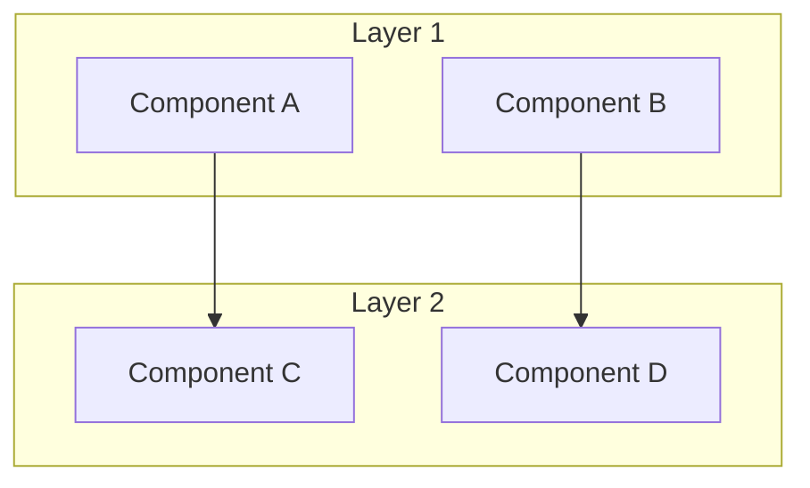

<!--
---
title: "[Project Name]"
description: "One-line description"
author: "VintageDon"
orcid: "0009-0008-7695-4093"
date: "YYYY-MM-DD"
version: "1.0"
status: "Active"
tags:
  - type: project-root
  - domain: [primary-domain]
  - tech: [key-technologies]
related_documents:
  - "[Related Link](url)"
---
-->

# 🎯 [Project Name]

<!-- 
BADGES: 
- Include 3-4 technology badges relevant to the project
- Include active OSS tool badges (Greptile, Snyk) that directly affect the repo
- Do NOT include project management tools (Atlassian) — those go in OSS Program Support section only
-->
[](url)
[](https://greptile.com)
[](https://snyk.io)
[](LICENSE)


> One-line description that captures the essence of the project.

[2-3 sentences expanding on what this project is, what it does, and why it exists. This is your elevator pitch.]

---

## 🔭 Overview

This section provides context for [domain/problem space]. If you're already familiar with [key concepts], skip to [Quick Start](#-quick-start).


[2-4 paragraphs explaining the context, problem space, and motivation for this project. What gap does it fill? What inspired it? Include domain-specific background that newcomers need.]

---

## 🎯 Target Audience

| Audience | Use Case |
|----------|----------|
| [Audience 1] | [How they use this] |
| [Audience 2] | [How they use this] |
| [Audience 3] | [How they use this] |

---

## 📊 Project Status

<!-- Use this for current state reporting -->

| Area | Status | Description |
|------|--------|-------------|
| [Area 1] | ✅ Production | [Description] |
| [Area 2] | 🔄 In Progress | [Description] |
| [Area 3] | ⬜ Planned | [Description] |

---
## 🏗️ Architecture

[Brief explanation of how the project is organized and why]

### [Architecture Diagram]

<!-- 
Use Mermaid for editable diagrams, or static images for complex visualizations.
Place primary architecture visual here.
-->



### [Key Architecture Table]

<!-- Use tables for structured technical information -->

| Component | Implementation | Purpose |
|-----------|----------------|---------|
| [Component] | [Technology] | [What it does] |
| [Component] | [Technology] | [What it does] |

<!-- Optional: Include hardware/infrastructure image if relevant -->


---

## 📁 Repository Structure

```markdown
project-name/
├── 📂 directory-1/       # Purpose
├── 📂 directory-2/       # Purpose
│   └── subdirectory/     # Purpose
├── 📚 docs/              # Documentation
├── 📄 LICENSE
└── 📄 README.md          # This file
```

---

## 🔧 [Domain-Specific Section]

<!--
This is a placeholder for project-specific content that doesn't fit standard sections.
Examples:
- "Platform Specifications" for infrastructure projects
- "AI Governance" for AI-heavy projects
- "Data Assets" for data science projects
- "API Reference" for service projects

Include tables, metrics, or structured information relevant to your domain.
-->

| [Attribute] | [Value] |
|-------------|---------|
| [Item] | [Detail] |
| [Item] | [Detail] |

---

## 🔬 [Related Work / Active Projects]

<!--
Optional section for projects that connect to other repositories or ongoing work.
Use brief table format with links.
-->

| Project | Focus | Status |
|---------|-------|--------|
| [Project Name](url) | [Brief description] | Active |
| [Project Name](url) | [Brief description] | Planned |

---

## 🤝 OSS Program Support

This repository benefits from open source programs that provide tooling to qualifying public repositories.

### Active Programs

| Program | Provides | Use Case |
|---------|----------|----------|
| [Greptile](https://greptile.com) | AI code review | PR review, sprint summaries |
| [Snyk](https://snyk.io/plans/) | Security scanning | Dependency vulnerability detection |
| [Atlassian](https://www.atlassian.com) | Jira, Confluence (Standard) | Project tracking, documentation |

### Available for Future Use

| Program | Provides | Planned Use |
|---------|----------|-------------|
| [SonarCloud](https://www.sonarsource.com/open-source-editions/) | Code quality | Static analysis |
| [Sentry](https://sentry.io/for/open-source/) | Error tracking | Runtime monitoring |
| [Datadog](https://www.datadoghq.com/partner/open-source/) | Observability | Metrics, logs, APM |

---

## 🌟 Open Science Philosophy

We practice open science and open methodology — our version of "showing your work":

- Research methodologies are fully documented and repeatable
- Infrastructure configurations are version-controlled and automated
- Scripts and pipelines are published so others can learn, adapt, or improve them
- Learning processes are captured and shared for community benefit

All projects operate under open source licenses (primarily MIT) to ensure maximum reproducibility.

---

## 🚀 Getting Started

<!--
Use role-based subsections for complex projects with multiple audiences.
Use simple command blocks for straightforward projects.
-->

### For [Audience 1]

1. [Step with link to relevant docs](path/to/docs)
2. [Step with link to relevant docs](path/to/docs)
3. [Step with link to relevant docs](path/to/docs)

### For [Audience 2]

1. [Step with link to relevant docs](path/to/docs)
2. [Step with link to relevant docs](path/to/docs)
3. [Step with link to relevant docs](path/to/docs)

### Quick Start (Alternative)

```bash
# Use this format for simple projects with command-based setup
command-1
command-2
command-3
```

---

## 📄 License

This project is licensed under the MIT License — see [LICENSE](LICENSE) for details.

---

## 🙏 Acknowledgments

- [Acknowledgment 1] — [Why acknowledged]
- Open source community — Tools and libraries that make this possible

---

Last Updated: [Date] | [Current Status or Phase]

<!--
=============================================================================
TEMPLATE USAGE NOTES (remove this entire block when using)
=============================================================================

REQUIRED SECTIONS:
1. Frontmatter (YAML in comment block)
2. Title with emoji + Banner image
3. Badges (tech + active OSS tools + license)
4. Blockquote tagline + intro paragraph
5. Background (with skip-ahead link and infographic)
6. Target Audience table
7. Architecture (diagram + tables)
8. Project Status table
9. Repository Structure tree
10. OSS Program Support (Active + Available)
11. Open Science Philosophy
12. Getting Started (role-based or quick start)
13. License
14. Acknowledgments
15. Last Updated footer

OPTIONAL SECTIONS:
- Domain-Specific Section (customize header/content for your project type)
- Related Work / Active Projects (if connected to other repos)

BADGE PHILOSOPHY:
- TOP BADGES = Tools that directly act on the repo (code review, security, tech stack)
- OSS SECTION = Sponsors/programs that benefit broadly (Atlassian stays here, not in badges)

IMAGE PATHS:
- assets/repo-banner.jpg — Required, wide format
- assets/background-infographic.jpg — Recommended for Background section
- assets/images/*.jpg — Optional domain-specific images

TABLES VS PROSE:
- Use tables for: specifications, status, audiences, technology stacks
- Use prose for: background context, philosophy statements
- Use code blocks for: commands, file structures

SKIP-AHEAD PATTERN:
Always include in Background: "If you're familiar with [X], skip to [Quick Start]"

=============================================================================
-->